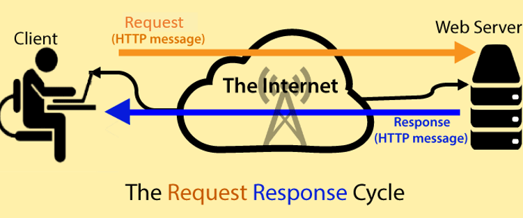
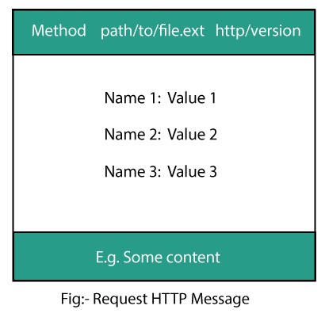
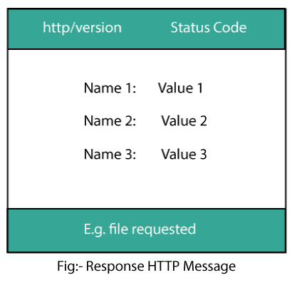

# HTTP


## TABLE OF CONTENT 

1. [**Introduction to HTTP**](#introduction-to-http)<!-- style="font-size:20px" -->
2. [**HTTP Parameters**](#http-parameters)<!-- style="font-size:20px" -->
3. [**Working of web**](#working-of-web)<!-- style="font-size:20px" -->
4. [**HTTP Messages**](#http-messages)<!-- style="font-size:20px" -->
5. [**HTTP Requests**](#http-request)<!-- style="font-size:20px" -->
6. [**HTTP Responses**](#http-responses)<!-- style="font-size:20px" -->
7. [**HTTP Methods**](#http-methods)<!-- style="font-size:20px" -->
8. [**HTTP Status Codes**](#)<!-- style="font-size:20px" -->
9. [**HTTP Header Fields**](#)<!-- style="font-size:20px" -->
10. [**HTTP Cookies**](#)<!-- style="font-size:20px" -->
11. [**HTTP Chaching**](#)<!-- style="font-size:20px" -->
12. [**HTTP URL Encoding**](#)<!-- style="font-size:20px" -->
13. [**HTTP Security**](#)<!-- style="font-size:20px" -->


## Introduction to HTTP

* [**What is HTTP**](#what-is-http)<!-- style="font-size:20px" -->
* [**Features of HTTP**](#features-of-http)<!-- style="font-size:20px" -->
* [**HTTP Architecture**](#http-architecture)<!-- style="font-size:20px" -->
* [**Advantages of HTTP**](#advantages-of-http)<!-- style="font-size:20px" -->
* [**Disadvantages of HTTP**](#disadvantages-of-http)<!-- style="font-size:20px" -->

### **What is HTTP**

* HTTP stands for Hyper Text Transfer Protocol
* The primary function of HTTP is to establish a connection with the server and send HTML pages back to the user's browser.
* HTTP is an application protocol that runs on top of the TCP/IP suite of protocols, which forms the foundation of the internet.


### **Features of HTTP**

There are three basic features of HTTP 

* **HTTP is connectionless** : The HTTP client, i.e., a browser initiates an HTTP request and after a request is made, the client waits for the response. The server processes the request and sends a response back after which client disconnect the connection. So client and server knows about each other during current request and response only. Further requests are made on new connection like client and server are new to each other.
* **HTTP is media independent**: It means, any type of data can be sent by HTTP as long as both the client and the server know how to handle the data content. It is required for the client as well as the server to specify the content type using appropriate MIME-type.
* **HTTP is stateless:** As mentioned above, HTTP is connectionless and it is a direct result of HTTP being a stateless protocol. The server and client are aware of each other only during a current request. Afterwards, both of them forget about each other. Due to this nature of the protocol, neither the client nor the browser can retain information between different requests across the web pages.

### **HTTP Architecture**

The following diagram shows a very basic architecture of a web application and depicts where HTTP sits:

<!-- width="250px" height="300px" -->

The HTTP protocol is a request/response protocol based on the client/server based architecture where web browsers, robots and search engines, etc. act like HTTP clients, and the Web server acts as a server.

Client
The HTTP client sends a request to the server in the form of a request method, URI, and protocol version, followed by a MIME-like message containing request modifiers, client information, and possible body content over a TCP/IP connection.

Server
The HTTP server responds with a status line, including the message's protocol version and a success or error code, followed by a MIME-like message containing server information, entity meta information, and possible entity-body content.

### **Advantages of HTTP**

1. **Addressing**: HTTP uses advanced scheme of addressing. It assigns IP address with recognizable names so that it can be identified easily in the World Wide Web. Compared to the standard procedure of IP address with a series of numbers, using this the public can easily engage with the internet.

2. **Flexibility** : Whenever there are additional capabilities needed by an application, HTTP has the capability to download extensions or plugins and display the relevant data. These can include Flash players and Acrobat reader.

3. **Security** : In HTTP each files is downloaded from an independent connection and then gets closed. Due to this no more than one single element of a webpage gets transferred. Therefore, the chance of interception during transmission is minimized here. 
 

4. **Latency** : Only when the connection is established, the handshaking process will take place in HTTP. Hence, there will be no handshaking procedure following a request. This significantly reduces latency in the connection. 

5. **Accessibility** : When the page is loaded for the first time, all of the HTTP pages gets stored inside the internet caches known as the page cache. Therefore, once the page is visited again, the content is loaded quickly.

### **Disadvantages of HTTP**

1. **Data Integrity** : Since there are no any encryption methods used in HTTP, there are chances of someone altering the content. That is the reason why HTTP is considered to be an insecure method prone to data integrity.
2. **Data Privacy** : Privacy is another problem faced in a HTTP connection. If any hacker manages to intercept the request they can view all the content present in the web page. Besides that they can also gather confidential informations such as the username and the password.

3. **Server Availability** : Even if HTTP receives all the data that it needs, clients does not take measures to close the connection. Therefore, during this time period, server will not be present. 

4. **Administrative Overhead** : For transmitting a web page, a HTTP needs to create multiple connections. This causes administrative overhead in the connection. 

5. **IoT Device Support** : HTTP uses more number of system resources which leads to more power consumption. Since IoT device today contain wireless sensor networks, it is not suitable to use HTTP. 

## HTTP Parameters

In this section, we will discuss various HTTP parameters and their syntax. For example, date and time format, character set, etc. These parameters are used in the construction of our request and response message while writing the HTTP program of the client or server.

The various parameters of HTTP are as follows:

* [**HTTP Version**](#http-version)
* [**Uniform Resource Identifiers**](#uniform-resource-identifiers)
* [**Date/Time Formats**](#date-or-time-formats)
* [**Character Sets**](#character-sets)
* [**Content Encodings**](#content-encodings)
* [**Media Types**](#media-types)
* [**Language Tags**](#language-tags)

### **HTTP Version**

HTTP uses a **<major>**.**<minor>** numbering scheme to indicate versions of the protocol. The version of an HTTP message is indicated by an HTTP-Version field in the first line.

Syntax:

```markdown
HTTP-Version   = "HTTP" "/" 1*DIGIT "." 1*DIGIT
```

Example:

```markdown
HTTP/1.0

or

HTTP/1.1
```

### **Uniform Resource Identifiers**

Uniform Resource Identifiers (URI) are simply formatted, case-insensitive string containing name, location, etc. to identify a resource, for example, a website, a web service, etc.

Syntax:

```markdown
URI = "http:" "//" host [ ":" port ] [ abs_path [ "?" query ]]
```

* "http" scheme is used to locate network resources through the HTTP protocol.
* Here if the port is empty or not given, port 80 is assumed for HTTP and an empty abs path is equivalent to an abs_path of "/". The characters other than those in the reserved and unsafe sets are equivalent to their ""%" HEX HEX" encoding.

Example:

```markdown
http://abc.com:80/~smith/home.html
http://ABC.com/%7Esmith/home.html
http://ABC.com:/%7esmith/home.html
```

### **Date or Time Formats**

* All HTTP date/time stamps MUST be represented in Greenwich Mean Time (GMT), without exception.
* HTTP applications are allowed to use any of the following three representations of date/time stamps:

```markdown
Sun, 06 Nov 1994 08:49:37 GMT  ; RFC 822, updated by RFC 1123
Sunday, 06-Nov-94 08:49:37 GMT ; RFC 850, obsoleted by RFC 1036
Sun Nov  6 08:49:37 1994       ; ANSI C's asctime() format
```

### **Character Sets**

We use character sets to specify the character sets that the client prefers. Multiple character sets can be listed separated by commas. If a value is not specified, the default is the US-ASCII

Example:

Following are the valid character sets:

```markdown
US-ASCII

or

ISO-8859-1

or 

ISO-8859-7
```

### **Content Encodings**

A content encoding value indicates that an encoding algorithm has been used to encode the content before passing it over the network. Content coding are primarily used to allow a document to be compressed or otherwise usefully transformed without losing the identity.

All content-coding values are case-insensitive. HTTP/1.1 uses content-coding values in the Accept-Encoding and Content-Encoding header fields which we will see in the subsequent chapters.

Example:

Following are the valid encoding schemes

```markdown
Accept-encoding: gzip

or

Accept-encoding: compress

or 

Accept-encoding: deflate
```

### **Media Types**

HTTP uses Internet Media Types in the Content-Type and Accept header fields in order to provide open and extensible data typing and type negotiation. All the Media-type values are registered with the Internet Assigned Number Authority (IANA).

The general syntax to specify media type is as follows:

```markdown
media-type     = type "/" subtype *( ";" parameter )
```

The type, subtype, and parameter attribute names are case--insensitive.

Example:

```markdown
Accept: image/gif
```

### **Language Tags**

HTTP uses language tags within the Accept-Language and Content-Language fields. A language tag is composed of one or more parts: a primary language tag and a possibly empty series of subtags:

```markdown
language-tag  = primary-tag *( "-" subtag )
```

White spaces are not allowed within the tag and all tags are case- insensitive.

Example:

```markdown
en, en-US, en-cockney, i-cherokee, x-pig-latin
```

## Working of Web

The browser sends an HTTP request message to the server, asking it to send a copy of the website to the client and server send back HTTP response message to browser. 

This message, and all other data sent between the client and the server, is sent across your internet connection using TCP/IP.



## HTTP Messages 

HTTP Message is used to show how data is exchanged between the client and the server. It is based on client-server architecture. An HTTP client is a program that establishes a connection to a server to send one or more HTTP request messages. An HTTP server is a program that accepts connections to serve HTTP requests by sending an HTTP response messages.

The HTTP Messages can be classified as follows:

* [**Message Type**](#media-types)
* [**Message Headers**](#message-headers)
* [**Message Body**](#message-body)
* [**Message Length**](#message-length)
* [**General Header Fields**](#general-header-fields)

### **Message Type**

HTTP message consists of an initial request line and an initial response line.

Format:

```markdown
HTTP-message = Request | Response ; HTTP/1.1 messages  
```

**Initial Request Line**

The initial line is different for the request and for the response. A request-line consists of three parts: a method name, requested resource's local path, and the HTTP version being used. All these parts are separated by spaces.

Syntax:

```markdown
GET /path/to/file/index.html HTTP/1.0 
```

* GET is the most common HTTP method.
* The path shows the part of the URL after the host name. It is also called a request URI.
* The version of HTTP always takes the form “HTTP/x.x”, uppercase.



**Initial Response Line**

The initial Response line is also known as the status line. It also has three parts: the HTTP version, a response status code that gives the result of the request, and the English reason phrase describing the status code.

```markdown
HTTP/1.0 200 OK  
or  
HTTP/1.0 404 Not Found
```  



### **Message Headers**

The Message header provides information about the request and response. It also provides information about the object which is sent in the message body. Message Headers are of four types:

* **General Header**: It has general applicability for both request messages and response messages.
* **Request Header**: It has applicability only for the request messages.
* **Response Header**: It has applicability only for the response messages.
* **Entity Header**: It defines meta-information about the entity-body, and about the resource identified by request.

All the above headers follow the same generic format. Each of the header fields consists of a name followed by a colon and the field values as follows:

```markdown
message-header = field-name ":" [ field-value ]  
```

### **Message Body**

The message body of an HTTP message is used to carry the entire body associated with the request and response. The message-body differs from the entire-body only when a transfer-coding has been applied, as indicated by the Transfer-Encoding header field.

Syntax

```markdown
message-body = entity-body  
        | <entity-body encoded as per Transfer-Encoding> 
``` 

Transfer-Encoding MUST be used to indicate any transfer-codings which is applied by an application to ensure safe and proper transfer of the message. Transfer-Encoding is a property of the message.

### Message Length

The transfer-length of a message is the length of the message-body, and it appears in the message.

In a message, when a message body is allowed, and Content-Length is given, its field value MUST exactly match the number of OCTETs in the message-body. When an invalid length is received and detected, the HTTP/1.1 user agents MUST notify the user.

### **General Header Fields**

Some header fields have the applicability for both the request and response messages. These header fields apply only when the message is transmitted.

Syntax

```markdown
general-header = Cache-Control 
``` 

## HTTP Request

An HTTP client sends an HTTP request to a server in the form of a request message which includes following format:

> * A Request Line
> * Zero or more header(General,Request,Entity) fields followed by CRLF
> * An empty line (i.e., a line with nothing preceding the CRLF) indicating the end of the header fields
> * Optionally a message-body

**Syntax**

```markdown
Request  = Request-Line                
        *(( general-header        
        | request-header           
        | entity-header ) CRLF)    
        CRLF  
        [ message-body ] 
``` 

* [**Request Line**](#request-line)
* [**Request Method**](#request-method)
* [**Request-URI**](#request-uri)
* [**Request Header Fields**](#request-header-fields)
* [**Examples**](#http-request-examples)

### **Request Line**

The Request-Line starts with a method token, which is followed by the Request-URI, the protocol version, and ending with CRLF. Using the SP characters, the elements are separated.

**Syntax**

```markdown
Request-Line   = Method SP Request-URI SP HTTP-Version CRLF 
``` 

### **Request Method**

The request method indicates the method to be performed on the resource identified by the given Request-URI. The method is case-sensitive and should always be mentioned in uppercase. The following table lists all the supported methods in HTTP/1.1.

| **_Sl No_** | **_Method_** | **_Description_**                                                                                                                                                                 |
|-------------|--------------|-----------------------------------------------------------------------------------------------------------------------------------------------------------------------------------|
| 1           | GET          | The GET method is used to retrieve information from the given server using a given URI. Requests using GET should only retrieve data and should have no other effect on the data. |
| 2           | HEAD         | Same as GET, but it transfers the status line and the header section only.                                                                                                        |
| 3           | POST         | A POST request is used to send data to the server, for example, customer information, file upload, etc. using HTML forms.                                                         |
| 4           | PUT          | Replaces all the current representations of the target resource with the uploaded content.                                                                                        |
| 5           | DELETE       | Removes all the current representations of the target resource given by URI.                                                                                                      |
| 6           | CONNECT      | Establishes a tunnel to the server identified by a given URI.                                                                                                                     |
| 7           | OPTIONS      | Describe the communication options for the target resource.                                                                                                                       |
| 8           | TRACE        | Performs a message loop back test along with the path to the target resource.                                                                                                     |

### **Request URI**

The Request-URI is a **Uniform Resource Identifier** and identifies the resource upon which to apply the request. Following are the most commonly used forms to specify an URI:

```markdown
Request-URI = "*" | absoluteURI | abs_path | authority
```

| **_Method_**  | **_Description_**                                                                                                                                                                                                                                |
|---------------|--------------------------------------------------------------------------------------------------------------------------------------------------------------------------------------------------------------------------------------------------|
| asterisk "*"  | The asterisk star is used to show that the request does not apply to a particular resource, but it will apply to the server itself. It is allowed only when the method used does not necessarily apply to a resource. Example: OPTIONS * HTTP/1.1|
| absoluteURI   | The absoluteURI form is used only when the request is being made to a proxy. The requested proxy is used to forward the request and return the response. Example : GET http://swayaan.com/ HTTP/1.1                                              |
| absolute path | The absolute path can't be empty. If in the original URI, none is present, it must be given as "/"                                                                                                                                               |
| authority     | The authority form is only used by the CONNECT method.                                                                                                                                                                                           |

### **Request Header Fields**

This request-header field allows the client to pass additional information to the server, including the request and the client.The request header fields function as request modifiers, with semantics similar to the parameters of a method invocation in a programming language.

Syntax

```markdown
request-header = Accept                     
                      | Accept-Charset            
                      | Accept-Encoding            
                      | Accept-Language            
                      | Authorization              
                      | Expect                    
                      | From                       
                      | Host                      
                      | If-Match                   
                      | If-Modified-Since        
                      | If-None-Match             
                      | If-Range                
                      | If-Unmodified-Since       
                      | Max-Forwards              
                      | Proxy-Authorization       
                      | Range                     
                      | Referer                   
                      | TE                        
                      | User-Agent  
```

### **HTTP Request Examples**

Now let's put it all together to form an HTTP request to fetch hello.htm page from the web

```markdown
GET /hello.htm HTTP/1.1
User-Agent: Mozilla/4.0 (compatible; MSIE5.01; Windows NT)
Host: www.tutorialspoint.com
Accept-Language: en-us
Accept-Encoding: gzip, deflate
Connection: Keep-Alive
```

## **HTTP Responses**

After receiving and interpreting a request message, a server responds with an HTTP response message

> * A Status-line
> * Zero or more header (General,Response,Entity) fields followed by CRLF
> * An empty line (i.e., a line with nothing preceding the CRLF) indicating the end of the header fields
> * Optionally a message-body

An HTTP response contains the following things:

* [**Status Line**](#message-status-line)
* [**Response Header Fields or a series of HTTP headers**](#response-header-fields)
* [**Examples**](#http-response-examples)

### **Message Status-Line**

A Status-Line consists of the protocol version followed by a numeric status code and its associated textual phrase. The elements are separated by space SP characters.

```markdown
Status-Line = HTTP-Version SP Status-Code SP Reason-Phrase CRLF
```

**HTTP Version**

A server supporting HTTP version 1.1 will return the following version information:

```markdown
HTTP-Version = HTTP/1.1
```

**Status Code**

The Status-Code element is a 3-digit integer where first digit of the Status-Code defines the class of response and the last two digits do not have any categorization role. There are 5 values for the first digit:

| **_Sl No_** | **_Code_**         | **_Description_**                                                        |
|-------------|--------------------|--------------------------------------------------------------------------|
| 1           | 1xx: Informational | It means the request was received and the process is continuing.         |
| 2           | 2xx: Success       | It means the action was successfully received, understood, and accepted. |
| 3           | 3xx: Redirection   | It means further action must be taken in order to complete the request.  |
| 4           | 4xx: Client Error  | It means the request contains incorrect syntax or cannot be fulfilled.   |
| 5           | 5xx: Server Error  | It means the server failed to fulfill an apparently valid request.       |

### **Response Header Fields**

The HTTP Headers for the response of the server contain the information that a client can use to find out more about the response, and about the server that sent it. This information is used to assist the client with displaying the response to a user, with storing the response for the use of future, and with making further requests to the server now or in the future.

```markdown
response-header = Accept-Ranges            
                  | Age                     
                  | ETag                     
                  | Location                
                  | Proxy-Authenticate       
                  | Retry-After              
                  | Server             
                  | Vary                    
                  | WWW-Authenticate     
```

### **HTTP Response Examples**

Now let's put it all together to form an HTTP response for a request to fetch the hello.htm page from the web server

```markdown
HTTP/1.1 200 OK
Date: Mon, 27 Jul 2009 12:28:53 GMT
Server: Apache/2.2.14 (Win32)
Last-Modified: Wed, 22 Jul 2009 19:15:56 GMT
Content-Length: 88
Content-Type: text/html
Connection: Closed
```

```htm
<html>
<body>
<h1>Hello, World!</h1>
</body>
</html>
```

The following example shows an HTTP response message displaying error condition when the web server could not find the requested page

```markdown
HTTP/1.1 404 Not Found
Date: Sun, 18 Oct 2012 10:36:20 GMT
Server: Apache/2.2.14 (Win32)
Content-Length: 230
Connection: Closed
Content-Type: text/html; charset=iso-8859-1
```

```htm
<!DOCTYPE HTML PUBLIC "-//IETF//DTD HTML 2.0//EN">
<html>
<head>
   <title>404 Not Found</title>
</head>
<body>
   <h1>Not Found</h1>
   <p>The requested URL /t.html was not found on this server.</p>
</body>
</html>
```

## **HTTP Methods**

For HTTP/1.1, the set of common methods are defined below. This set can be expanded based on the requirements. The name of these methods is case sensitive, and they must be used in uppercase.

| **_Method _** | **_Description _**                                                                                                                                                                |
|---------------|-----------------------------------------------------------------------------------------------------------------------------------------------------------------------------------|
| [**GET**](#get-method)       | The GET method is used to retrieve information from the given server using a given URI. Requests using GET should only retrieve data and should have no other effect on the data. |
| [**HEAD**](#head-method)      | Same as GET, but it transfers the status line and the header section only.                                                                                                        |
| [**POST**](#post-method)      | A POST request is used to send data to the server, for example, customer information, file upload, etc. using HTML forms.                                                         |
| [**PUT**](#put-method)       | Replaces all the current representations of the target resource with the uploaded content.                                                                                        |
| [**DELETE**](#delete-method)    | Removes all the current representations of the target resource given by URI.                                                                                                      |
| [**CONNECT**](#connect-method)   | Establishes a tunnel to the server identified by a given URI.                                                                                                                     |
| [**OPTIONS**](#options-method)   | Describe the communication options for the target resource.                                                                                                                       |
| [**TRACE**](#trace-method)     | Performs a message loop back test along with the path to the target resource.                                                                                                     |

### **GET Method**

A GET request retrieves data from a web server by specifying parameters in the URL portion of the request. This is the main method used for document retrieval. The following example makes use of GET method to fetch hello.htm:

```markdown
GET /hello.htm HTTP/1.1
User-Agent: Mozilla/4.0 (compatible; MSIE5.01; Windows NT)
Host: www.tutorialspoint.com
Accept-Language: en-us
Accept-Encoding: gzip, deflate
Connection: Keep-Alive
```

The server response against the above GET request will be as follows:

```markdown
HTTP/1.1 200 OK
Date: Mon, 27 Jul 2009 12:28:53 GMT
Server: Apache/2.2.14 (Win32)
Last-Modified: Wed, 22 Jul 2009 19:15:56 GMT
ETag: "34aa387-d-1568eb00"
Vary: Authorization,Accept
Accept-Ranges: bytes
Content-Length: 88
Content-Type: text/html
Connection: Closed
```

```htm
<html>
<body>
<h1>Hello, World!</h1>
</body>
</html>
```

### **HEAD Method**

The HEAD method is functionally similar to GET, except that the server replies with a response line and headers, but no entity-body. The following example makes use of HEAD method to fetch header information about hello.htm:

```markdown
HEAD /hello.htm HTTP/1.1
User-Agent: Mozilla/4.0 (compatible; MSIE5.01; Windows NT)
Host: www.tutorialspoint.com
Accept-Language: en-us
Accept-Encoding: gzip, deflate
Connection: Keep-Alive
```

The server response against the above HEAD request will be as follows:

```markdown
HTTP/1.1 200 OK
Date: Mon, 27 Jul 2009 12:28:53 GMT
Server: Apache/2.2.14 (Win32)
Last-Modified: Wed, 22 Jul 2009 19:15:56 GMT
ETag: "34aa387-d-1568eb00"
Vary: Authorization,Accept
Accept-Ranges: bytes
Content-Length: 88
Content-Type: text/html
Connection: Closed
```

You can notice that here server the does not send any data after header.

### **POST Method**

The POST method is used when you want to send some data to the server, for example, file update, form data, etc. The following example makes use of POST method to send a form data to the server, which will be processed by a process.cgi and finally a response will be returned:

```markdown
POST /cgi-bin/process.cgi HTTP/1.1
User-Agent: Mozilla/4.0 (compatible; MSIE5.01; Windows NT)
Host: www.tutorialspoint.com
Content-Type: text/xml; charset=utf-8
Content-Length: 88
Accept-Language: en-us
Accept-Encoding: gzip, deflate
Connection: Keep-Alive
```

```htm
<?xml version="1.0" encoding="utf-8"?>
<string xmlns="http://clearforest.com/">string</string>
```

The server side script process.cgi processes the passed data and sends the following response:

```markdown
HTTP/1.1 200 OK
Date: Mon, 27 Jul 2009 12:28:53 GMT
Server: Apache/2.2.14 (Win32)
Last-Modified: Wed, 22 Jul 2009 19:15:56 GMT
ETag: "34aa387-d-1568eb00"
Vary: Authorization,Accept
Accept-Ranges: bytes
Content-Length: 88
Content-Type: text/html
Connection: Closed
```

```htm
<html>
<body>
<h1>Request Processed Successfully</h1>
</body>
</html>
```

### **PUT Method**

The PUT method is used to request the server to store the included entity-body at a location specified by the given URL. The following example requests the server to save the given entity-body in hello.htm at the root of the server:

```markdown
PUT /hello.htm HTTP/1.1
User-Agent: Mozilla/4.0 (compatible; MSIE5.01; Windows NT)
Host: www.tutorialspoint.com
Accept-Language: en-us
Connection: Keep-Alive
Content-type: text/html
Content-Length: 182
```

```htm
<html>
<body>
<h1>Hello, World!</h1>
</body>
</html>
```

The server will store the given entity-body in hello.htm file and will send the following response back to the client:

```markdown
HTTP/1.1 201 Created
Date: Mon, 27 Jul 2009 12:28:53 GMT
Server: Apache/2.2.14 (Win32)
Content-type: text/html
Content-length: 30
Connection: Closed
```

```htm
<html>
<body>
<h1>The file was created.</h1>
</body>
</html>
```

### **DELETE Method**

The DELETE method is used to request the server to delete a file at a location specified by the given URL. The following example requests the server to delete the given file hello.htm at the root of the server:

```markdown
DELETE /hello.htm HTTP/1.1
User-Agent: Mozilla/4.0 (compatible; MSIE5.01; Windows NT)
Host: www.tutorialspoint.com
Accept-Language: en-us
Connection: Keep-Alive
```

The server will delete the mentioned file hello.htm and will send the following response back to the client:

```markdown
HTTP/1.1 200 OK
Date: Mon, 27 Jul 2009 12:28:53 GMT
Server: Apache/2.2.14 (Win32)
Content-type: text/html
Content-length: 30
Connection: Closed
```

```htm
<html>
<body>
<h1>URL deleted.</h1>
</body>
</html>
```

### **CONNECT Method**

The CONNECT method is used by the client to establish a network connection to a web server over HTTP. The following example requests a connection with a web server

```markdown
CONNECT www.tutorialspoint.com HTTP/1.1
User-Agent: Mozilla/4.0 (compatible; MSIE5.01; Windows NT)
```

The connection is established with the server and the following response is sent back to the client:

```markdown
HTTP/1.1 200 Connection established
Date: Mon, 27 Jul 2009 12:28:53 GMT
Server: Apache/2.2.14 (Win32)
```

### **OPTIONS Method**

The OPTIONS method is used by the client to find out the HTTP methods and other options supported by a web server. The client can specify a URL for the OPTIONS method, or an asterisk (*) to refer to the entire server. The following example requests a list of methods supported by a web server running on tutorialspoint.com:

```markdown
OPTIONS * HTTP/1.1
User-Agent: Mozilla/4.0 (compatible; MSIE5.01; Windows NT)
```

The server will send an information based on the current configuration of the server, for example:

```markdown
HTTP/1.1 200 OK
Date: Mon, 27 Jul 2009 12:28:53 GMT
Server: Apache/2.2.14 (Win32)
Allow: GET,HEAD,POST,OPTIONS,TRACE
Content-Type: httpd/unix-directory
```

### **TRACE Method**

The TRACE method is used to echo the contents of an HTTP Request back to the requester which can be used for debugging purpose at the time of development. The following example shows the usage of TRACE method:

```markdown
TRACE / HTTP/1.1
Host: www.tutorialspoint.com
User-Agent: Mozilla/4.0 (compatible; MSIE5.01; Windows NT)
```

The server will send the following message in response to the above request:

```markdown
HTTP/1.1 200 OK
Date: Mon, 27 Jul 2009 12:28:53 GMT
Server: Apache/2.2.14 (Win32)
Connection: close
Content-Type: message/http
Content-Length: 39

TRACE / HTTP/1.1
Host: www.tutorialspoint.com
User-Agent: Mozilla/4.0 (compatible; MSIE5.01; Windows NT)
```